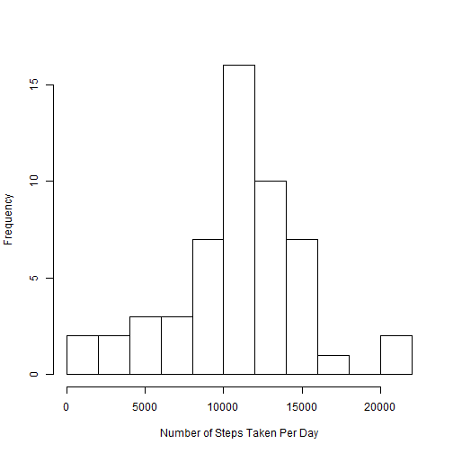
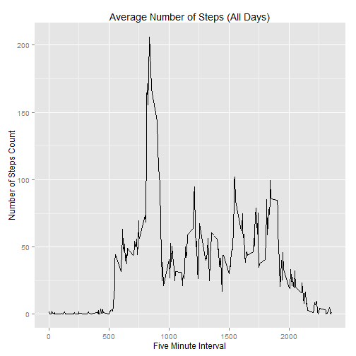
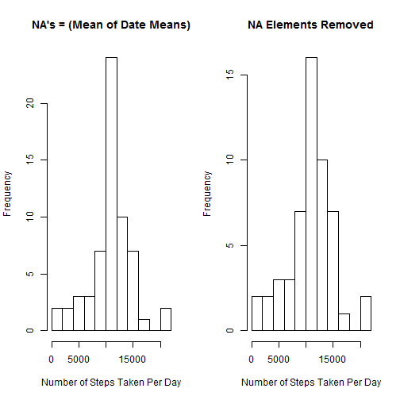
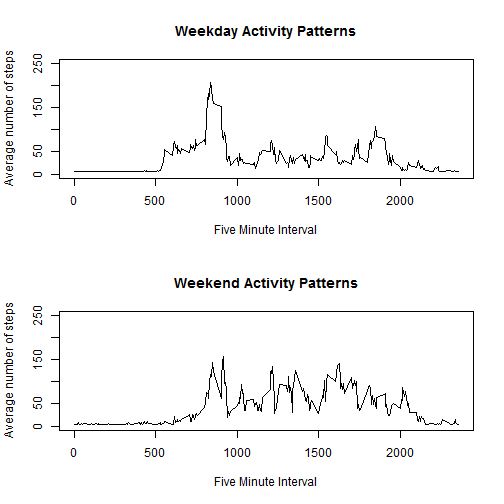

## Reproducible Research: Peer Assessment 1


#### Introduction

It is now possible to collect a large amount of data about personal movement using activity monitoring devices such as a Fitbit, Nike Fuelband, or Jawbone Up. These type of devices are part of the "quantified self" movement - a group of enthusiasts who take measurements about themselves regularly to improve their health, to find patterns in their behavior, or because they are tech geeks. But these data remain under-utilized both because the raw data are hard to obtain and there is a lack of statistical methods and software for processing and interpreting the data.

This assignment makes use of data from a personal activity monitoring device. This device collects data at 5 minute intervals through out the day. The data consists of two months of data from an anonymous individual collected during the months of October and November, 2012 and include the number of steps taken in 5 minute intervals each day.


#### Data

The data for this assignment can be downloaded from the course web site:

Dataset: Activity monitoring data [52K]
The variables included in this dataset are:

- steps: Number of steps taking in a 5-minute interval (missing values are coded as NA)

- date: The date on which the measurement was taken in YYYY-MM-DD format

- interval: Identifier for the 5-minute interval in which measurement was taken

The dataset is stored in a comma-separated-value (CSV) file and there are a total of 17,568 observations in this dataset.

#### Load Needed Library(s)


```r
## Load Needed Library
library(plyr)
library(dplyr)
```

```
## 
## Attaching package: 'dplyr'
## 
## The following objects are masked from 'package:plyr':
## 
##     arrange, count, desc, failwith, id, mutate, rename, summarise,
##     summarize
## 
## The following object is masked from 'package:stats':
## 
##     filter
## 
## The following objects are masked from 'package:base':
## 
##     intersect, setdiff, setequal, union
```

```r
library(ggplot2)
```

```
## Warning: package 'ggplot2' was built under R version 3.1.2
```


#### Loading and preprocessing the data

Show any code that is needed to

Load the data (i.e. read.csv())

Process/transform the data (if necessary) into a format suitable for your analysis


```r
## Load the activity data, then convert to table
rawActivity <- read.csv("activity.csv")
rawActivity <- tbl_df(rawActivity)

## Show Structure of the raw data
str(rawActivity)
```

```
## Classes 'tbl_df', 'tbl' and 'data.frame':	17568 obs. of  3 variables:
##  $ steps   : int  NA NA NA NA NA NA NA NA NA NA ...
##  $ date    : Factor w/ 61 levels "2012-10-01","2012-10-02",..: 1 1 1 1 1 1 1 1 1 1 ...
##  $ interval: int  0 5 10 15 20 25 30 35 40 45 ...
```


#### What is mean total number of steps taken per day?

For this part of the assignment, you can ignore the missing values in the dataset.

Make a histogram of the total number of steps taken each day

Calculate and report the mean and median total number of steps taken per day


```r
## Create a subset of the data without the NA values
RemoveNA <- rawActivity %>% filter(is.na(steps) == FALSE) 

## Sum steps for each date
StepsByDate <- RemoveNA %>% group_by(date) %>% summarize(StepsPerDay = sum(steps))

head(StepsByDate)
```

```
## Source: local data frame [6 x 2]
## 
##         date StepsPerDay
## 1 2012-10-02         126
## 2 2012-10-03       11352
## 3 2012-10-04       12116
## 4 2012-10-05       13294
## 5 2012-10-06       15420
## 6 2012-10-07       11015
```

```r
## Plot a histogram of the summary data
hist(StepsByDate$StepsPerDay, breaks = 10, main="", xlab="Number of Steps Taken Per Day")
```

 

```r
## Calculate the Mean
mean(StepsByDate$StepsPerDay) 
```

```
## [1] 10766.19
```

```r
## Calculate the Median
median(StepsByDate$StepsPerDay) 
```

```
## [1] 10765
```


#### What is the average daily activity pattern?

Make a time series plot (i.e. type = "l") of the 5-minute interval (x-axis) and the average number of steps taken, averaged across all days (y-axis)

Which 5-minute interval, on average across all the days in the dataset, contains the maximum number of steps?


```r
# Calculate average steps for each of 5-minute interval during a 24-hour period
StepsPerDayMean <- ddply(RemoveNA,~interval, summarise, mean=mean(steps))

qplot(x=interval, y=mean, data = StepsPerDayMean,  geom = "line",
      xlab="Five Minute Interval",
      ylab="Number of Steps Count",
      main="Average Number of Steps (All Days)"
      )
```

 

```r
StepsPerDayMean[which.max(StepsPerDayMean$mean), ]
```

```
##     interval     mean
## 104      835 206.1698
```


#### Imputing missing values

Note that there are a number of days/intervals where there are missing values (coded as NA). The presence of missing days may introduce bias into some calculations or summaries of the data.

Calculate and report the total number of missing values in the dataset (i.e. the total number of rows with NAs)

Devise a strategy for filling in all of the missing values in the dataset. The strategy does not need to be sophisticated. For example, you could use the mean/median for that day, or the mean for that 5-minute interval, etc.

Create a new dataset that is equal to the original dataset but with the missing data filled in.

Make a histogram of the total number of steps taken each day and Calculate and report the mean and median total number of steps taken per day. Do these values differ from the estimates from the first part of the assignment? What is the impact of imputing missing data on the estimates of the total daily number of steps?

NOTE: Since we have no idea what the NA values are supposed to represent, I'm using the mean between the lowest and highest number of steps taken from the entire dataset (not by 5min or days)


```r
## Find the number of missing values (NA's)
sum(is.na(rawActivity$steps))
```

```
## [1] 2304
```

```r
## Create new dataset for NA's manipulation
Activity2 <- rawActivity
str(Activity2)
```

```
## Classes 'tbl_df', 'tbl' and 'data.frame':	17568 obs. of  3 variables:
##  $ steps   : int  NA NA NA NA NA NA NA NA NA NA ...
##  $ date    : Factor w/ 61 levels "2012-10-01","2012-10-02",..: 1 1 1 1 1 1 1 1 1 1 ...
##  $ interval: int  0 5 10 15 20 25 30 35 40 45 ...
```

```r
## Find the mean of each date
ActivityMean <- RemoveNA %>% group_by(date) %>% summarize(MeanSteps = mean(steps))

## Replacing NA with a mean calculated from using the means of each date (see previous step)
Activity2$steps <- replace(Activity2$steps, is.na(Activity2$steps), mean(ActivityMean$MeanSteps))
head(Activity2)
```

```
## Source: local data frame [6 x 3]
## 
##     steps       date interval
## 1 37.3826 2012-10-01        0
## 2 37.3826 2012-10-01        5
## 3 37.3826 2012-10-01       10
## 4 37.3826 2012-10-01       15
## 5 37.3826 2012-10-01       20
## 6 37.3826 2012-10-01       25
```

```r
## Check to see if NA's have been updated to 0
sum(is.na(Activity2))
```

```
## [1] 0
```

```r
## Sum the new dataset with the filled in NA entries
StepsByDateFilledNAs <- Activity2  %>% group_by(date) %>% summarize(StepsPerDay = sum(steps))
str(Activity2)
```

```
## Classes 'tbl_df', 'tbl' and 'data.frame':	17568 obs. of  3 variables:
##  $ steps   : num  37.4 37.4 37.4 37.4 37.4 ...
##  $ date    : Factor w/ 61 levels "2012-10-01","2012-10-02",..: 1 1 1 1 1 1 1 1 1 1 ...
##  $ interval: int  0 5 10 15 20 25 30 35 40 45 ...
```

```r
head(StepsByDateFilledNAs)
```

```
## Source: local data frame [6 x 2]
## 
##         date StepsPerDay
## 1 2012-10-01    10766.19
## 2 2012-10-02      126.00
## 3 2012-10-03    11352.00
## 4 2012-10-04    12116.00
## 5 2012-10-05    13294.00
## 6 2012-10-06    15420.00
```

```r
## Compare the two histograms side by side
par(mfrow=c(1,2))
## Plot a histogram of the summary data (NA's replaced by mean of min/max overall steps counted)
hist(StepsByDateFilledNAs$StepsPerDay, breaks = 10, main="NA's = (Mean of Date Means)", xlab="Number of Steps Taken Per Day")

## Plot a histogram of the summary data (Original Without NA's)
hist(StepsByDate$StepsPerDay, breaks = 10, main="NA Elements Removed", xlab="Number of Steps Taken Per Day")
```

 

Calculate the mean/median of the new dataset, then compare to old


```r
mean(StepsByDateFilledNAs$StepsPerDay)
```

```
## [1] 10766.19
```

```r
median(StepsByDateFilledNAs$StepsPerDay)
```

```
## [1] 10766.19
```

```r
 mean(StepsByDateFilledNAs$StepsPerDay)-mean(StepsByDate$StepsPerDay)
```

```
## [1] 0
```

```r
 median(StepsByDateFilledNAs$StepsPerDay)-median(StepsByDate$StepsPerDay)
```

```
## [1] 1.188679
```

The impact is minimal, only the median seems to change slightly.


#### Are there differences in activity patterns between weekdays and weekends?

For this part the weekdays() function may be of some help here. Use the dataset with the filled-in missing values for this part.

Create a new factor variable in the dataset with two levels - "weekday" and "weekend" indicating whether a given date is a weekday or weekend day.

Make a panel plot containing a time series plot (i.e. type = "l") of the 5-minute interval (x-axis) and the average number of steps taken, averaged across all weekday days or weekend days (y-axis). See the README file in the GitHub repository to see an example of what this plot should look like using simulated data.


```r
Activity2$weekday <- weekdays(as.Date(Activity2$date))
Activity2$factorWeekday <- as.factor(c("weekend", "weekday"))
Activity2[Activity2$weekday == "Sunday" | Activity2$weekday == "Saturday", 5]<- factor("weekend")
Activity2[!(Activity2$weekday == "Sunday" | Activity2$weekday == "Saturday"), 5]<- factor("weekday")


Activity2Weekend <- subset(Activity2, factorWeekday == "weekend") 
Activity2Weekday <- subset(Activity2, factorWeekday == "weekday") 
DailyActivityWeekend <- tapply(Activity2Weekend$steps, Activity2Weekend$interval, mean)
DailyActivityWeekday <- tapply(Activity2Weekday$steps, Activity2Weekday$interval, mean)

par(mfrow=c(2,1))
plot(y = DailyActivityWeekday, x = names(DailyActivityWeekday), type = "l", xlab = "Five Minute Interval", 
     main = "Weekday Activity Patterns", ylab = "Average number of steps", 
     ylim =c(0, 250))
plot(y = DailyActivityWeekend, x = names(DailyActivityWeekend), type = "l", xlab = "Five Minute Interval", 
     main = "Weekend Activity Patterns", ylab = "Average number of steps", 
     ylim =c(0, 250))
```

 
